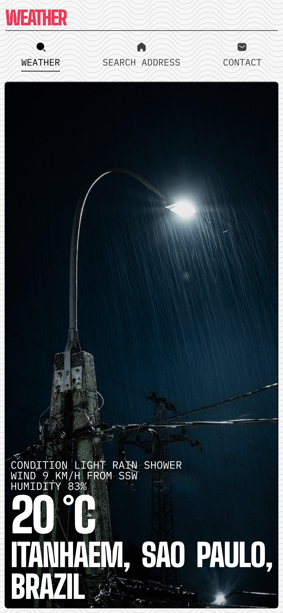

# OCTOKEY



## Como Executar o Projeto

Clone o repositório:
```
   git clone https://github.com/caiankeller/octokey caiankeller@octokey
```

Navegue para o diretório do projeto:
```
   cd caiankeller@octokey
```

Instale as dependências:
```
   npm i
```

Execute o projeto:
```
   npm run dev
```
> É necessário obter uma chave de API, mais informações em .env.example. A API utilizada pode ser encontrada em https://www.weatherapi.com/docs/

### Outros Comandos Úteis
```
   npm run format
   npm run lint
   npm run build
```

```javascript
async function fetchWeatherImages(query) {
  const apiUrl = `https://api.unsplash.com/search/photos/?query=${encodeURIComponent(query)}&client_id=${unsplashApiKey}`;
  const response = await fetch(apiUrl);
  const data = await response.json();
  return data.results[0]?.urls?.regular || null;
}

function generateFilename(url) {
  const hash = crypto.createHash('sha256').update(url).digest('hex');
  return `${hash}.jpg`;
}

async function downloadAndSaveImage(url, filename) {
  const response = await fetch(url);
  const buffer = await response.arrayBuffer();  
  fs.writeFileSync(filename, Buffer.from(buffer));  
}

async function enhanceDataWithImagesAndSave() {
  const dataWithImages = await Promise.all(data.map(async item => {
    const randomDelay = Math.floor(Math.random() * 5000);
    await new Promise(resolve => setTimeout(resolve, randomDelay));

    const dayBackgroundUrl = await fetchWeatherImages(item.day);
    const nightBackgroundUrl = await fetchWeatherImages(item.night);

    const dayFilename = generateFilename(dayBackgroundUrl);
    const nightFilename = generateFilename(nightBackgroundUrl);

    await downloadAndSaveImage(dayBackgroundUrl, dayFilename);
    await downloadAndSaveImage(nightBackgroundUrl, nightFilename);

    return {
      code: item.code,
      day: { condition: item.day, background: dayFilename },
      night: { condition: item.night, background: nightFilename }
    };
  }));
}
async function fetchWeatherImages(query) {
  const apiUrl = `https://api.unsplash.com/search/photos/?query=${encodeURIComponent(query)}&client_id=${unsplashApiKey}`;
  const response = await fetch(apiUrl);
  const data = await response.json();
  return data.results[0]?.urls?.regular || null;
}

function generateFilename(url) {
  const hash = crypto.createHash('sha256').update(url).digest('hex');
  return `${hash}.jpg`;
}

async function downloadAndSaveImage(url, filename) {
  const response = await fetch(url);
  const buffer = await response.arrayBuffer();  
  fs.writeFileSync(filename, Buffer.from(buffer));  
}

async function enhanceDataWithImagesAndSave() {
  const dataWithImages = await Promise.all(data.map(async item => {
    const randomDelay = Math.floor(Math.random() * 5000);
    await new Promise(resolve => setTimeout(resolve, randomDelay));

    const dayBackgroundUrl = await fetchWeatherImages(item.day);
    const nightBackgroundUrl = await fetchWeatherImages(item.night);

    const dayFilename = generateFilename(dayBackgroundUrl);
    const nightFilename = generateFilename(nightBackgroundUrl);

    await downloadAndSaveImage(dayBackgroundUrl, dayFilename);
    await downloadAndSaveImage(nightBackgroundUrl, nightFilename);

    return {
      code: item.code,
      day: { condition: item.day, background: dayFilename },
      night: { condition: item.night, background: nightFilename }
    };
  }));
  fs.writeFileSync("backgrounds.ts", JSON.stringify(dataWithImages, null, 2))
}
```
